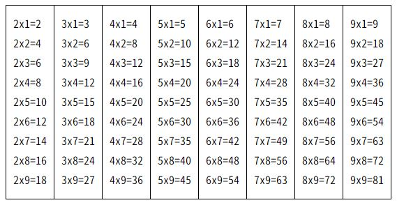
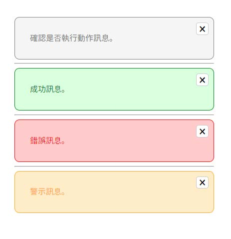
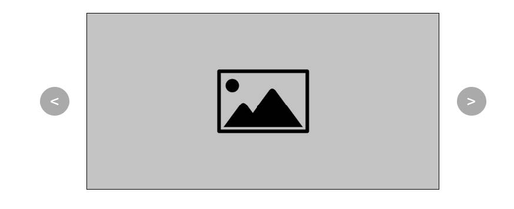
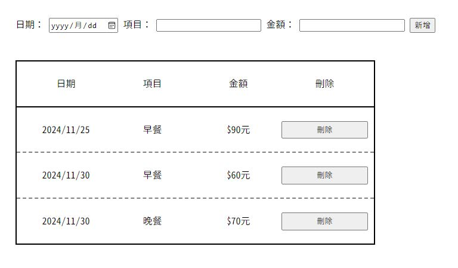

## [靜態網頁](https://Eddie110102.github.io/JavaScript_practice)
## [原始碼](https://github.com/Eddie110102/JavaScript_practice)

## 1. 讓使用者可以輸入自己的體重及身高，根據算出來的 BMI 值顯示下列訊息 [(解答)](./01_BMI.html)

> - 公式
>   - BMI = 體重(公斤)/身高(公尺)的平方

> - 判斷標準
>   - BMI ＜ 18.5：過輕
>   - 18.5≦BMI ＜ 24：正常
>   - 24≦BMI ＜ 27：過重
>   - 27≦BMI ＜ 30：輕度肥胖
>   - 30≦BMI ＜ 35：中度肥胖
>   - BMI≧35：重度肥胖

## 2. 輸入西元年，判斷是否是閏年 [(解答)](./02_Leap-Year.html)

> - 標準
>   - 西元除以 400 可整除，為閏年
>   - 西元除以 4 可整除但除以 100 不可整除，為閏年
>   - 西元除以 4 不可整除，為平年
>   - 西元除以 100 可整除但除以 400 不可整除，為平年

## 3. 請畫出九九乘法表 [(解答)](./03_Multiplication-Table.html)

## 4. 請設計一個 function，傳入攝氏溫度可以轉成華氏溫度，傳入華氏溫度可以轉成攝氏溫度 [(解答)](./04_Temperature-Translate.html)

> - 公式
>   - 華氏要換算成攝氏時，要先減 32 後，再乘以 5/9
>   - 攝氏要換算成華氏時，要先乘以 9/5，再加上 32。

## 5. 讓使用者輸入生日計算目前幾歲 [(解答)](./05_Birthday.html)

## 6. 驗證使用者輸入的密碼，條件如下 [(解答)](./06_Password-regex.html) [(解答\_separate)](./06_Password-regex-separate.html)

> - 條件
>   - 8 位數以上
>   - 至少包含一個大寫字母
>   - 小寫字母
>   - 數字
>   - 符號

## 7. 請使用以下 HTML 結構與預設 CSS 選擇器 ，透過 JavaScript 實作 alert 元件，並且可以點擊「 × 」將其 alert 元件關閉。 [(解答)](./07_alert.html)

> &lt;div class="alert alert-question">  > &emsp;&lt;p>確認是否執行動作訊息。&lt;/p>  > &emsp;&lt;button class="close">×&lt;/button>  > &lt;/div>
>
> 

> &lt;div class="alert alert-success"> 
> &emsp;&lt;p>成功訊息。&lt;/p> 
> &emsp;&lt;button class="close">×&lt;/button> 
> &lt;/div>
> 

> &lt;div class="alert alert-error"> 
> &emsp;&lt;p>錯誤訊息。&lt;/p> 
> &emsp;&lt;button class="close">×&lt;/button> 
> &lt;/div>
> 

> &lt;div class="alert alert-warning"> 
> &emsp;&lt;p>警示訊息。&lt;/p> 
> &emsp;&lt;button class="close">×&lt;/button> 
> &lt;/div>
> 

## 8. Carousel 元件 [(解答)](./08_carousel.html) [(解答_pagination)](./08_carousel-pagination.html)

> 1. 請自行設計一個寬度 600px、高度 300px 的輪播牆。
> 2. 請勿使用 Bootstrap 或是其他套件。
> 3. Carousel 要有點擊切換圖片的功能，並使用下方 data 的圖片呈現在輪播牆中。
> 4. 輪播牆可增加自動播放圖片功能。

## 9. 記帳本 [(解答)](./09_account-book.html)
> 1. 請設計一個記帳本。
> 2. 可以讓使用者透過單行控制項輸入記帳內容。
> 3. 點擊「 新增 」可以將內容新增到畫面的記帳本區域中。
> 4. 點擊「 刪除 」可以將單筆資料移除。
> 5. 備註：至少要有紀錄日期、支出項目與金額。

